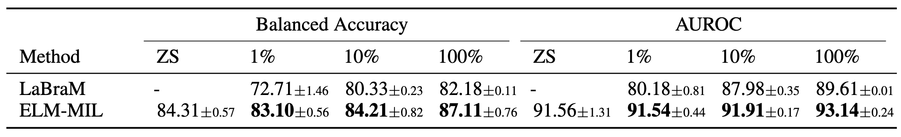
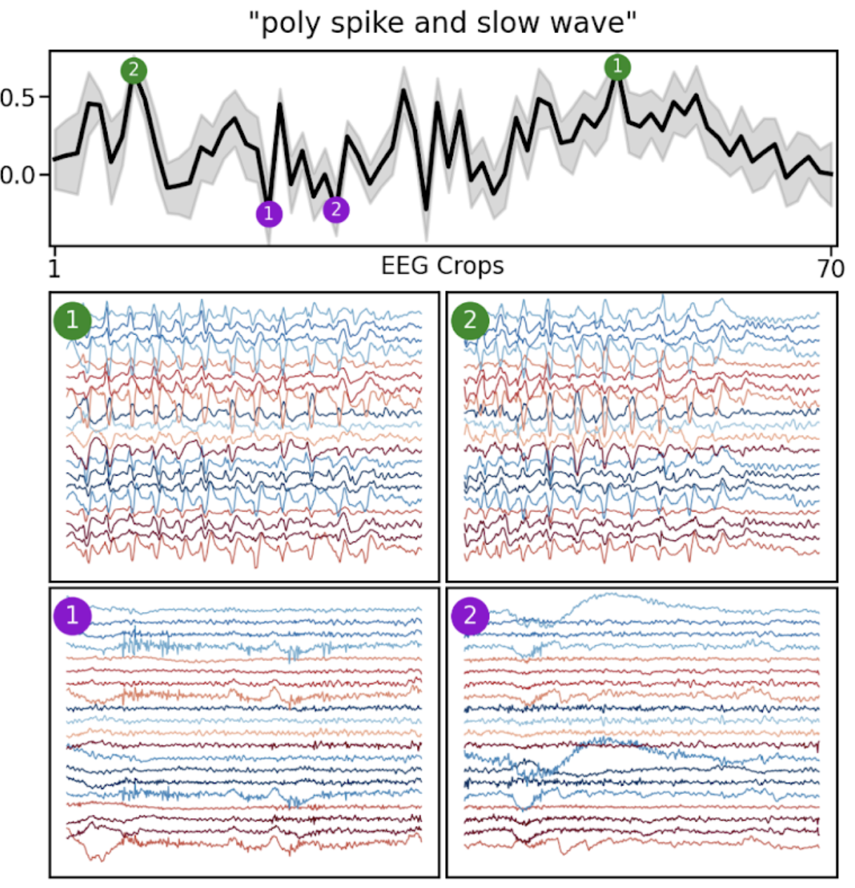

# [ICML25] EEG-Language Pretraining for Highly Label-Efficient Clinical Phenotyping

**저자:** Sam Gijsen, Kerstin Ritter

📄 논문 링크 (OpenReview): https://openreview.net/forum?id=yaI2ZYFmeD

> 이 폴더는 [SamGijsen/ELM](https://github.com/SamGijsen/ELM) 원본 저장소를 vendor(그대로 복사)한 것입니다. 아래 내용은 원본 README를 한국어로 번역하고, 각 섹션이 실제로 무엇을 하는지 설명을 덧붙인 것입니다.

이 저장소는 ICML 2025 논문 **"EEG-Language Pretraining for Highly Label-Efficient Clinical Phenotyping"**의 코드와 사전학습 모델을 제공합니다. 이 논문은 EEG(뇌파)와 임상 텍스트 리포트를 함께 학습하는 **EEG-Language Model (ELM)**을 소개합니다.

뇌파(EEG)와 임상 리포트를 함께 학습한 멀티모달 모델은 다음을 보여줍니다:
- 여러 다운스트림 질병 진단(disease detection) 평가에서 성능 향상
- 최초로 뇌파와 임상 리포트 간의 상호 검색(retrieval) 가능
- 최초로 임상 텍스트 프롬프트만으로 뇌파를 zero-shot 분류 가능

<br>

<div align="center">
  
  <br>
  <i>이상 탐지(abnormality detection)를 위한 zero-shot 분류 및 linear probing 결과.</i>
</div>

<br>

<div align="center">
  
  <br>
  <i>자연어 프롬프트를 이용한 임상 이벤트 검색(retrieval) 예시.</i>
</div>

## 설치 (Setup)

이 코드베이스는 다음 기능을 제공합니다:
* TUH EEG Corpus 원본 임상 EEG 데이터 전처리
* EEG epoch와 임상 텍스트 리포트를 이용한 멀티모달 사전학습(pretraining)
* 사전학습된 EEG 인코더를 이용한 다운스트림 분류 작업의 linear probing

<br>

1.  저장소 클론:
    ```bash
    git clone https://github.com/SamGijsen/ELM.git
    cd ELM
    ```
2.  의존성 설치:
    ```bash
    # conda로 PyTorch 설치 (CUDA 지원)
    conda install pytorch=1.12.1 torchvision=0.13.1 torchaudio=0.12.1 cudatoolkit=11.3 -c pytorch

    # 나머지는 pip으로 설치
    pip install -r requirements.txt
    ```

## 데이터 전처리 (Data Preprocessing)

모델은 전처리된 EEG 데이터를 입력으로 받습니다. 전처리 코드는 `utils/`에 있습니다.

### 전처리 단계

`utils/preprocess_TUEG.py`는 자신의 데이터셋에 맞게 수정해서 사용할 수 있습니다. 기본 전처리 파이프라인은 다음 단계로 구성됩니다:

*   **대역통과 필터(Bandpass filter):** 0.1 - 49Hz
*   **리샘플링(Resampling):** 100Hz
*   **진폭 클리핑(Amplitude clipping)**
*   **몽타주(Montage):** 아래 채널을 사용하는 20채널 longitudinal bipolar TCP montage

#### 채널
```
"Fp1-F7", "F7-T3", "T3-T5", "T5-O1",
"Fp2-F8", "F8-T4", "T4-T6", "T6-O2",
"T3-C3", "C3-Cz", "Cz-C4", "C4-T4",
"Fp1-F3", "F3-C3", "C3-P3", "P3-O1",
"Fp2-F4", "F4-C4", "C4-P4", "P4-O2"
```

## 데이터 포맷 (Data Format)

이 프레임워크는 HDF5(`.h5`) 형식의 데이터를 사용합니다. 사전학습(pre-training)을 위해 `.h5` 파일은 다음 필드를 포함해야 합니다:

*   **필수 필드:**
    *   `features`: `(전체 샘플 수, 채널 수, 타임스텝 수)` 형태의 3D NumPy 배열 (EEG 데이터). `embeddings`라는 이름으로도 가능.
    *   `subject_ids`: 샘플별 subject ID를 담은 `(전체 샘플 수,)` 형태의 1D NumPy 배열.
    *   `dataset_mean`: `features` 정규화에 사용되는 스칼라 또는 배열.
    *   `dataset_std`: `features` 정규화에 사용되는 스칼라 또는 배열.

*   **선택 필드:**
    *   `age`(또는 `ages`), `sex`, `pathology`(또는 `pat`), `epoch_ids`: 데이터 stratification이나 라벨로 사용 가능한 `(전체 샘플 수,)` 형태의 1D NumPy 배열.

임상 리포트는 별도의 line-delimited JSON 파일에서 로드되며, 텍스트를 담은 `report` 필드가 있어야 하고 subject ID를 인덱스로 사용해야 합니다.

## 멀티모달 사전학습 (Multimodal Pretraining)

`run_DL.py` 스크립트로 멀티모달 자기지도(self-supervised) 사전학습을 실행합니다.

모델, 데이터셋, 학습 파라미터를 지정하는 YAML 설정 파일이 필요합니다. 예시 설정 파일은 `pretrained/` 디렉토리 안(`pretrained/5s/config_xy.yaml`, `pretrained/60s/config_xy.yaml`)에 있습니다.

설정 파일의 `training` 아래 `setting` 값을 `SSL_PRE`로 지정해야 합니다.

`torchrun`으로 사전학습을 실행합니다:
```bash
torchrun --nproc_per_node=1 run_DL.py -f your_config.yaml
```

## Linear Probing 워크플로우

다운스트림 작업에 대한 linear probing을 위해서는, 먼저 고정된(frozen) 사전학습 인코더로 임베딩을 생성한 뒤 그 임베딩 위에 선형 모델을 학습시킵니다.

### 1. 임베딩 생성

`run_DL.py`의 `"GEN_EMB"` 설정을 사용해 사전학습된 모델로부터 EEG 임베딩을 생성할 수 있습니다.

1.  **설정**: `.yaml` 설정 파일의 `training` 섹션에서 `setting`을 `"GEN_EMB"`로 지정합니다. 또한 `cfg["model"]["pretrained_path"]`에 사전학습된 모델 경로를 지정해야 합니다.

2.  **임베딩 생성 실행**: 설정 파일로 `run_DL.py`를 실행합니다:

    ```bash
    python run_DL.py -f your_config.yaml
    ```

    실행하면 모델 디렉토리 안에 생성된 임베딩을 담은 `embedding_dataset.h5` 파일이 새로 만들어집니다.

### 2. Linear Probing

`embedding_dataset.h5` 파일이 준비되면 `run_ML.py` 스크립트로 linear probing을 수행할 수 있습니다.

이 스크립트도 YAML 설정 파일이 필요합니다. 설정에서 `setting`을 `SSL_LIN`으로 지정하고 `embedding_dataset.h5` 파일 경로를 지정하세요.

다음과 같이 linear evaluation을 실행합니다:
```bash
python run_ML.py -f your_linear_eval_config.yaml
```
설정 파일에 정의된 하이퍼파라미터에 대해 cross-validation을 수행합니다.

## 사전학습 모델 (Pretrained Models)

두 가지 사전학습된 EEG 인코더를 제공합니다:
*   `./pretrained/5s/`: 5초 길이 EEG epoch와 임상 텍스트로 학습됨.
*   `./pretrained/60s/`: 60초 길이 EEG epoch와 임상 텍스트로 학습됨.

### 사용 예시

아래 Python 코드는 사전학습 모델을 로드하고 표현(representation)을 추출하는 방법을 보여줍니다. 이 예시는 5초 모델을 사용하지만, `config_path`와 `weights_path`만 바꾸면 60초 모델도 동일하게 로드할 수 있습니다.

```python
import torch
import yaml
from models.models import EEG_ResNet

# 디바이스 설정
device = torch.device("cuda" if torch.cuda.is_available() else "cpu")

# 5초 모델 경로
config_path = 'pretrained/5s/config_xy.yaml'
weights_path = 'pretrained/5s/model_0_checkpoint.pt'

# 설정 파일 로드
with open(config_path, 'r') as file:
    config = yaml.safe_load(file)

# 설정으로부터 모델 초기화
mp = config["model"]
encoder = EEG_ResNet(
    in_channels=mp["in_channels"],
    conv1_params=mp["encoder_conv1_params"],
    n_blocks=mp["encoder_blocks"],
    res_params=mp["encoder_res_params"],
    res_pool_size=mp["encoder_pool_size"],
    dropout_p=mp["encoder_dropout_p"],
    res_dropout_p=mp["res_dropout_p"],
    proj_size=mp["ELM"]["eeg_proj_size"]
).to(device)

# 사전학습 가중치 로드
state_dict = torch.load(weights_path, map_location=device)

# DDP로 학습되었으므로 state dict 키를 조정
if config["training"]["DDP"]:
    new_state_dict = {key.replace("module.", ""): value for key, value in state_dict.items()}
    state_dict = new_state_dict

encoder.load_state_dict(state_dict)
encoder.eval()

# 합성(synthetic) 데이터 생성
batch_size = 4
n_channels = mp["in_channels"]
n_time_samples = mp["n_time_samples"]
synth_data = torch.randn(batch_size, n_channels, n_time_samples, device=device)

# 임베딩 추출
with torch.no_grad():
    emb, proj_emb = encoder(synth_data)

print(f"Representation shape from encoder: {emb.shape}")
print(f"Projected representation shape from encoder: {proj_emb.shape}")
```

## 인용 (Citation)

이 모델이나 코드를 연구에 사용하신다면 아래 논문을 인용해 주세요.

```
@inproceedings{
gijsen2025eeglanguage,
title={{EEG}-Language Pretraining for Highly Label-Efficient Clinical Phenotyping},
author={Sam Gijsen and Kerstin Ritter},
booktitle={Forty-second International Conference on Machine Learning},
year={2025},
url={https://openreview.net/forum?id=yaI2ZYFmeD}
}
```
